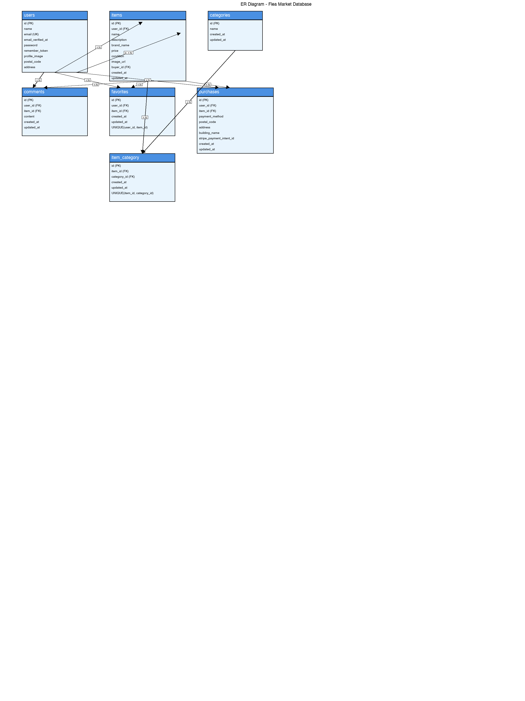

# test3

## 環境構築

**Dockerビルド**

1. `git clone <リポジトリURL>`

2. `cd test3`

3. DockerDesktopアプリを立ち上げる

4. `docker-compose up -d --build`

> *MacのM1・M2チップのPCの場合、`no matching manifest for linux/arm64/v8 in the manifest list entries`のメッセージが表示されビルドができないことがあります。

エラーが発生する場合は、docker-compose.ymlファイルの「mysql」内に「platform」の項目を追加で記載してください*

``` yaml
mysql:
    platform: linux/x86_64  # この行を追加
    image: mysql:8.0
    environment:
```

**Laravel環境構築**

1. `docker-compose exec php bash`

2. `composer install`

3. `.env`ファイルを作成し、以下の環境変数を追加

``` text
DB_CONNECTION=mysql
DB_HOST=mysql
DB_PORT=3306
DB_DATABASE=fleamarket
DB_USERNAME=laravel
DB_PASSWORD=laravel
```

4. アプリケーションキーの作成

``` bash
php artisan key:generate
```

5. マイグレーションの実行

``` bash
php artisan migrate
```

6. シーディングの実行（オプション）

``` bash
php artisan db:seed
```

7. シンボリックリンク作成

``` bash
php artisan storage:link
```

## 使用技術(実行環境)

- PHP 8.2
- Laravel 12.0
- MySQL 8.0

## ER図



## URL

- 開発環境：http://localhost/
- MailHog：http://localhost:8025/
