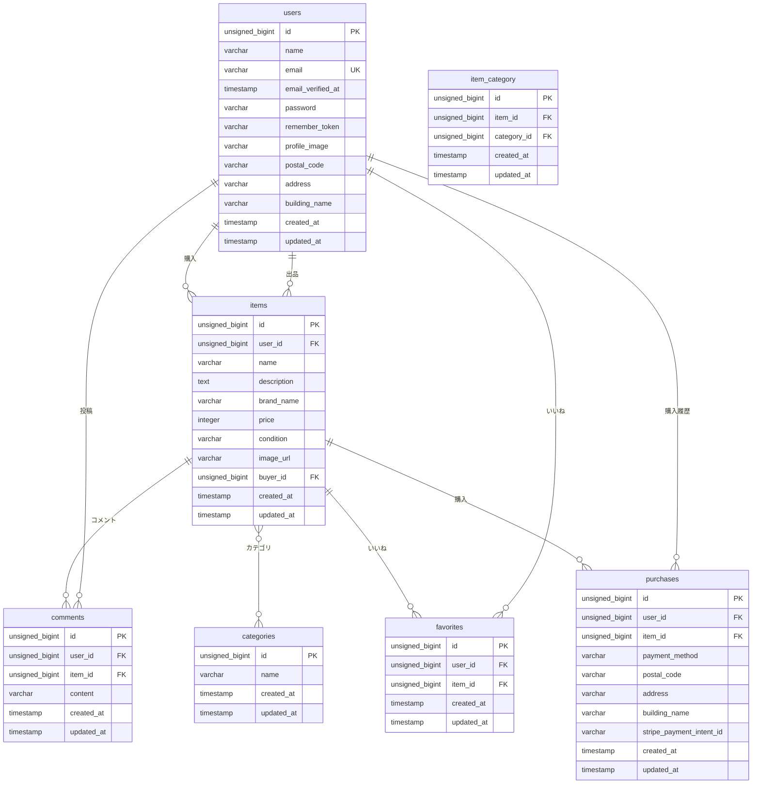

# ルート・コントローラー一覧表

| 画面名称 | パス | メソッド | ルート先コントローラー | アクション | 認証必須 | 説明 |
|---------|------|---------|---------------------|-----------|---------|------|
| 商品一覧画面（トップ画面） | / | GET | ItemController | index | 不要 | 商品一覧ページ |
| 商品一覧画面（トップ画面）_マイリスト | /mylist | GET | ItemController | mylist | 不要※ | いいねした商品一覧（未認証時は空） |
| 会員登録画面 | /register | GET | Fortify | - | 不要 | 会員登録ページ（Fortify） |
| ログイン画面 | /login | GET | Fortify | - | 不要 | ログインページ（Fortify） |
| 商品詳細画面 | /item/{id} | GET | ItemController | show | 不要 | 商品詳細ページ |
| 商品購入画面 | /purchase/{itemId} | GET | PurchaseController | show | 必須 | 商品購入確認ページ |
| 住所変更ページ | /purchase/address/{itemId} | GET | PurchaseController | address | 必須 | 購入時の住所変更ページ |
| 商品出品画面 | /sell | GET | SellController | create | 必須 | 商品出品フォームページ |
| プロフィール画面 | /mypage | GET | ProfileController | index | 必須 | プロフィールページ（デフォルト：出品した商品一覧） |
| プロフィール編集画面 | /mypage/profile | GET | ProfileController | edit | 必須 | プロフィール編集フォームページ |
| プロフィール画面_購入した商品一覧 | /mypage?page=buy | GET | ProfileController | index | 必須 | 購入した商品一覧（クエリパラメータで表示切替） |
| プロフィール画面_出品した商品一覧 | /mypage?page=sell | GET | ProfileController | index | 必須 | 出品した商品一覧（クエリパラメータで表示切替） |

## 補足情報

### POSTルート（フォーム送信など）
| 画面名称 | パス | メソッド | ルート先コントローラー | アクション | 認証必須 | 説明 |
|---------|------|---------|---------------------|-----------|---------|------|
| 商品出品処理 | /sell | POST | SellController | store | 必須 | 商品出品処理 |
| 商品購入処理 | /purchase/{itemId} | POST | PurchaseController | store | 必須 | 商品購入処理 |
| 住所更新処理 | /purchase/address/{itemId} | POST | PurchaseController | updateAddress | 必須 | 住所更新処理 |
| プロフィール更新処理 | /mypage/profile | PUT | ProfileController | update | 必須 | プロフィール更新処理 |
| いいね機能 | /favorite/{itemId} | POST | FavoriteController | toggle | 必須 | いいねの追加/削除 |
| コメント機能 | /comment/{itemId} | POST | CommentController | store | 必須 | コメント投稿 |

※ マイリスト：未認証時でもアクセス可能ですが、空のリストが表示されます。

---

# モデル一覧表

| モデル名 | テーブル名 | 主キー | 主要カラム | リレーション | 説明 |
|---------|----------|--------|-----------|------------|------|
| User | users | id | id, name, email, password, profile_image, postal_code, address, building_name, email_verified_at, remember_token, created_at, updated_at | hasMany(Item), hasMany(Favorite), hasMany(Comment), hasMany(Purchase), hasMany(Item->buyer_id) | ユーザー（会員）情報 |
| Item | items | id | id, user_id, name, description, brand_name, price, condition, image_url, buyer_id, created_at, updated_at | belongsTo(User), belongsTo(User->buyer_id), belongsToMany(Category), hasMany(Favorite), hasMany(Comment), hasMany(Purchase) | 商品情報 |
| Category | categories | id | id, name, created_at, updated_at | belongsToMany(Item) | カテゴリ情報 |
| Comment | comments | id | id, user_id, item_id, content, created_at, updated_at | belongsTo(User), belongsTo(Item) | コメント情報 |
| Favorite | favorites | id | id, user_id, item_id, created_at, updated_at | belongsTo(User), belongsTo(Item) | いいね情報（user_id, item_idの複合ユニーク制約あり） |
| Purchase | purchases | id | id, user_id, item_id, payment_method, postal_code, address, building_name, stripe_payment_intent_id, created_at, updated_at | belongsTo(User), belongsTo(Item) | 購入情報 |

## 中間テーブル

| テーブル名 | 主要カラム | 外部キー | 説明 |
|----------|-----------|---------|------|
| item_category | id, item_id, category_id, created_at, updated_at | item_id → items.id, category_id → categories.id | 商品とカテゴリの多対多リレーション（item_id, category_idの複合ユニーク制約あり） |

## モデルメソッド・機能

| モデル名 | メソッド/機能 | 説明 |
|---------|------------|------|
| Item | isSold() | 商品が売却済みかどうかを判定（buyer_idがnullでない場合true） |
| User | purchasedItems() | 購入した商品を取得（Itemのbuyer_idがuser_idと一致するもの） |

## リレーション詳細

### Userモデル
- **items()**: 出品した商品一覧（hasMany）
- **favorites()**: いいねした商品一覧（hasMany）
- **comments()**: 投稿したコメント一覧（hasMany）
- **purchases()**: 購入履歴一覧（hasMany）
- **purchasedItems()**: 購入した商品一覧（Itemのbuyer_id経由で取得）

### Itemモデル
- **user()**: 出品者（belongsTo）
- **buyer()**: 購入者（belongsTo）
- **categories()**: カテゴリ一覧（belongsToMany）
- **favorites()**: いいね一覧（hasMany）
- **comments()**: コメント一覧（hasMany）
- **purchases()**: 購入履歴一覧（hasMany）

### Categoryモデル
- **items()**: このカテゴリに属する商品一覧（belongsToMany）

### Commentモデル
- **user()**: コメント投稿者（belongsTo）
- **item()**: コメント対象の商品（belongsTo）

### Favoriteモデル
- **user()**: いいねしたユーザー（belongsTo）
- **item()**: いいね対象の商品（belongsTo）

### Purchaseモデル
- **user()**: 購入者（belongsTo）
- **item()**: 購入した商品（belongsTo）

---

# ビュー（Bladeファイル）一覧表

| 画面名称 | bladeファイル名 |
|---------|----------------|
| 商品一覧画面（トップ画面） | items/index.blade.php |
| 会員登録画面 | auth/register.blade.php |
| ログイン画面 | auth/login.blade.php |
| 商品詳細画面 | items/show.blade.php |
| 商品購入画面 | purchase/show.blade.php |
| 送付先住所変更画面 | purchase/address.blade.php |
| 商品出品画面 | sell/create.blade.php |
| プロフィール画面 | profile/index.blade.php |
| プロフィール編集画面（設定画面） | profile/edit.blade.php |

## 補足：その他のビューファイル

| ファイル名 | 説明 |
|----------|------|
| items/mylist.blade.php | マイリスト画面（いいねした商品一覧） |
| profile/initial-setup.blade.php | 初回プロフィール設定画面 |
| auth/verify-email-notice.blade.php | メール認証通知画面 |
| layouts/app.blade.php | メインレイアウトファイル |
| components/header.blade.php | ヘッダーコンポーネント |
| components/footer.blade.php | フッターコンポーネント |
| welcome.blade.php | ウェルカムページ |

---

# テーブル仕様

| No. | テーブル名 | カラム名 | 型 | PRIMARY KEY | UNIQUE KEY | NOT NULL | FOREIGN KEY |
|-----|----------|---------|---|------------|-----------|----------|------------|
| 1 | usersテーブル | | | | | | |
| | | id | unsigned bigint | ○ | | ○ | |
| | | name | varchar(255) | | | ○ | |
| | | email | varchar(255) | | ○ | ○ | |
| | | email_verified_at | timestamp | | | | |
| | | password | varchar(255) | | | ○ | |
| | | remember_token | varchar(100) | | | | |
| | | profile_image | varchar(255) | | | | |
| | | postal_code | varchar(255) | | | | |
| | | address | varchar(255) | | | | |
| | | building_name | varchar(255) | | | | |
| | | created_at | timestamp | | | | |
| | | updated_at | timestamp | | | | |
| 2 | itemsテーブル | | | | | | |
| | | id | unsigned bigint | ○ | | ○ | |
| | | user_id | unsigned bigint | | | ○ | users(id) |
| | | name | varchar(255) | | | ○ | |
| | | description | text | | | ○ | |
| | | brand_name | varchar(255) | | | | |
| | | price | integer | | | ○ | |
| | | condition | varchar(255) | | | ○ | |
| | | image_url | varchar(255) | | | ○ | |
| | | buyer_id | unsigned bigint | | | | users(id) |
| | | created_at | timestamp | | | | |
| | | updated_at | timestamp | | | | |
| 3 | categoriesテーブル | | | | | | |
| | | id | unsigned bigint | ○ | | ○ | |
| | | name | varchar(255) | | | ○ | |
| | | created_at | timestamp | | | | |
| | | updated_at | timestamp | | | | |
| 4 | commentsテーブル | | | | | | |
| | | id | unsigned bigint | ○ | | ○ | |
| | | user_id | unsigned bigint | | | ○ | users(id) |
| | | item_id | unsigned bigint | | | ○ | items(id) |
| | | content | varchar(255) | | | ○ | |
| | | created_at | timestamp | | | | |
| | | updated_at | timestamp | | | | |
| 5 | favoritesテーブル | | | | | | |
| | | id | unsigned bigint | ○ | | ○ | |
| | | user_id | unsigned bigint | | | ○ | users(id) |
| | | item_id | unsigned bigint | | | ○ | items(id) |
| | | created_at | timestamp | | | | |
| | | updated_at | timestamp | | | | |
| | | (user_id, item_id) | - | | ○ | | |
| 6 | purchasesテーブル | | | | | | |
| | | id | unsigned bigint | ○ | | ○ | |
| | | user_id | unsigned bigint | | | ○ | users(id) |
| | | item_id | unsigned bigint | | | ○ | items(id) |
| | | payment_method | varchar(255) | | | ○ | |
| | | postal_code | varchar(255) | | | | |
| | | address | varchar(255) | | | | |
| | | building_name | varchar(255) | | | | |
| | | stripe_payment_intent_id | varchar(255) | | | | |
| | | created_at | timestamp | | | | |
| | | updated_at | timestamp | | | | |
| 7 | item_categoryテーブル | | | | | | |
| | | id | unsigned bigint | ○ | | ○ | |
| | | item_id | unsigned bigint | | | ○ | items(id) |
| | | category_id | unsigned bigint | | | ○ | categories(id) |
| | | created_at | timestamp | | | | |
| | | updated_at | timestamp | | | | |
| | | (item_id, category_id) | - | | ○ | | |

## 外部キー制約の詳細

| テーブル名 | カラム名 | 参照先テーブル | 参照先カラム | 削除時の動作 |
|----------|---------|-------------|------------|------------|
| items | user_id | users | id | CASCADE |
| items | buyer_id | users | id | SET NULL |
| comments | user_id | users | id | CASCADE |
| comments | item_id | items | id | CASCADE |
| favorites | user_id | users | id | CASCADE |
| favorites | item_id | items | id | CASCADE |
| purchases | user_id | users | id | CASCADE |
| purchases | item_id | items | id | CASCADE |
| item_category | item_id | items | id | CASCADE |
| item_category | category_id | categories | id | CASCADE |

## 複合ユニーク制約

| テーブル名 | ユニーク制約カラム | 説明 |
|----------|-----------------|------|
| favorites | (user_id, item_id) | 同一ユーザーが同じ商品に複数回いいねできないようにする |
| item_category | (item_id, category_id) | 同一商品が同じカテゴリに複数回紐付けられないようにする |

---

# ER図

## ER図（画像版）

*上記はMermaid記法で描画されたER図です。画像版も生成されています。*

## ER図の説明

- **users（ユーザー）**: 会員情報を管理するテーブル
  - 1つのユーザーは複数の商品を出品できる（1対多）
  - 1つのユーザーは複数の商品を購入できる（1対多）
  - 1つのユーザーは複数のコメントを投稿できる（1対多）
  - 1つのユーザーは複数の商品にいいねできる（1対多）
  - 1つのユーザーは複数の購入履歴を持つ（1対多）

- **items（商品）**: 商品情報を管理するテーブル
  - 1つの商品は1人のユーザーが出品する（多対1）
  - 1つの商品は0または1人のユーザーに購入される（多対0..1）
  - 1つの商品は複数のコメントを持つ（1対多）
  - 1つの商品は複数のいいねを持つ（1対多）
  - 1つの商品は複数の購入履歴を持つ（1対多）
  - 1つの商品は複数のカテゴリに属する（多対多）

- **categories（カテゴリ）**: 商品カテゴリを管理するテーブル
  - 1つのカテゴリは複数の商品に紐付けられる（多対多）

- **comments（コメント）**: 商品に対するコメントを管理するテーブル
  - 1つのコメントは1人のユーザーが投稿する（多対1）
  - 1つのコメントは1つの商品に属する（多対1）

- **favorites（いいね）**: 商品へのいいねを管理するテーブル
  - 1つのいいねは1人のユーザーがつける（多対1）
  - 1つのいいねは1つの商品に属する（多対1）
  - ユニーク制約: (user_id, item_id) で同一ユーザーが同じ商品に複数回いいねできない

- **purchases（購入履歴）**: 商品の購入履歴を管理するテーブル
  - 1つの購入履歴は1人のユーザーが作成する（多対1）
  - 1つの購入履歴は1つの商品に属する（多対1）

- **item_category（商品-カテゴリ中間テーブル）**: 商品とカテゴリの多対多リレーションを管理
  - ユニーク制約: (item_id, category_id) で同一商品が同じカテゴリに複数回紐付けられない

